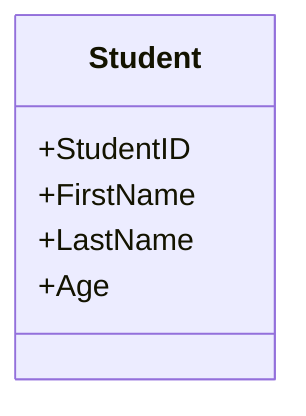
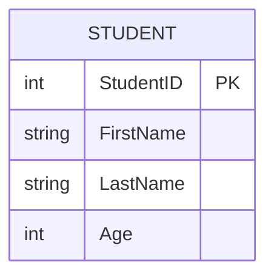
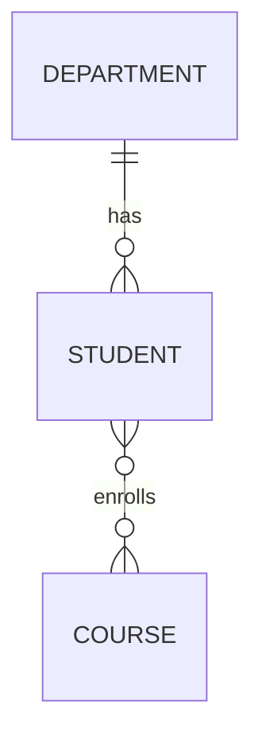
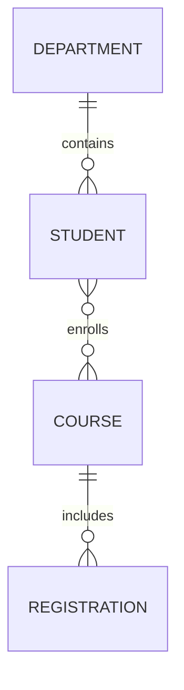

# ER Model

## Overview
The Entity-Relationship (ER) model is the first major design layer in database modeling. It describes the data in terms of entities, attributes, and relationships without worrying yet about physical storage details.

This model is used to capture the business meaning of a system before translating it into tables, keys, and constraints.

---

## 1. Main Components of the ER Model

### Entity
An entity is a real-world object or concept that we want to store information about.

Examples:
- Student
- Department
- Course
- Employee
- Order

### Attribute
An attribute is a property of an entity.

Examples:
- Student: StudentID, Name, Age
- Department: DepartmentID, DepartmentName

### Relationship
A relationship describes how entities are associated with each other.

Examples:
- Student enrolls in Course
- Department employs Employee
- Customer places Order

---

## 2. Entity Representation

An entity is often drawn as a rectangle.



A strong entity has its own independent existence. A weak entity depends on another entity for identity.

---

## 3. Attributes and Keys

### Simple attribute
A single-valued characteristic.

### Composite attribute
More than one part, such as FullName = FirstName + LastName.

### Derived attribute
Calculated from other data, such as Age from DateOfBirth.

### Key attribute
An attribute that uniquely identifies an entity instance.

Example:
- `StudentID` uniquely identifies a student



---

## 4. Relationship Types

### One-to-One (1:1)
One instance of A relates to one instance of B.

Example:
- One employee has one employee profile.

### One-to-Many (1:N)
One instance of A relates to many instances of B.

Example:
- One department has many students.

### Many-to-Many (M:N)
Many instances of A relate to many instances of B.

Example:
- Students enroll in many courses.
- Courses have many students.

This is usually resolved later by creating a junction/bridge table in the relational design.



---

## 5. Cardinality and Participation

### Cardinality
Cardinality tells us how many instances are allowed in the relationship.

Examples:
- one-to-many
- many-to-many
- one-to-one

### Participation
Participation tells us whether every instance must participate in the relationship.

Examples:
- total participation: every student must belong to a department
- partial participation: not every employee must manage a project

---

## 6. Example ER Diagram



This diagram shows:
- a department can have many students
- a student can enroll in many courses
- a course can have many enrolled students

---

## 7. ER Diagram Conventions

Typical ER notations:

- rectangle = entity
- oval = attribute
- diamond = relationship
- lines = connections between entities
- PK label = primary-key attribute

> 💡 **Best practice**
> Keep the ER diagram close to the business meaning, not the physical database implementation.

---

## 8. Diagram Illustration


This image is stored in the lesson folder and is used to visually illustrate the ER model and its relationships.

---

## 9. SSMS and SQL Mapping

ER modeling is usually done in a design tool or on paper before creating tables. In SSMS, the equivalent step is:

1. Open SSMS.
2. Connect to the server.
3. Create a database.
4. Right-click Tables > New > Table.
5. Add columns and assign primary keys.
6. Add foreign keys to represent relationships.

---

## 10. Equivalent T-SQL Example

```sql
CREATE DATABASE UniversityDB;
GO

USE UniversityDB;
GO

CREATE TABLE Department (
    DepartmentID INT PRIMARY KEY,
    DepartmentName VARCHAR(100) NOT NULL
);

CREATE TABLE Student (
    StudentID INT PRIMARY KEY,
    FirstName VARCHAR(50) NOT NULL,
    LastName VARCHAR(50) NOT NULL,
    DepartmentID INT,
    CONSTRAINT FK_Student_Department
        FOREIGN KEY (DepartmentID)
        REFERENCES Department(DepartmentID)
);

CREATE TABLE Course (
    CourseID INT PRIMARY KEY,
    CourseName VARCHAR(100) NOT NULL
);

CREATE TABLE Enrollment (
    StudentID INT,
    CourseID INT,
    PRIMARY KEY (StudentID, CourseID),
    CONSTRAINT FK_Enrollment_Student
        FOREIGN KEY (StudentID)
        REFERENCES Student(StudentID),
    CONSTRAINT FK_Enrollment_Course
        FOREIGN KEY (CourseID)
        REFERENCES Course(CourseID)
);
```

---

## 11. Exam-Friendly Summary

- ER model = conceptual representation of data
- Entity = object or thing
- Attribute = property of entity
- Relationship = association between entities
- Cardinality = how many instances participate
- Many-to-many relationships are usually converted into bridge tables later

> 💡 **Core idea**
> The ER model describes the business structure clearly before translating it into relational tables.

---

> 🔗 **See also**
> - [../02_EER_Model/theory.md](../02_EER_Model/theory.md)
> - [../03_ER_to_Relational_Mapping/theory.md](../03_ER_to_Relational_Mapping/theory.md)

