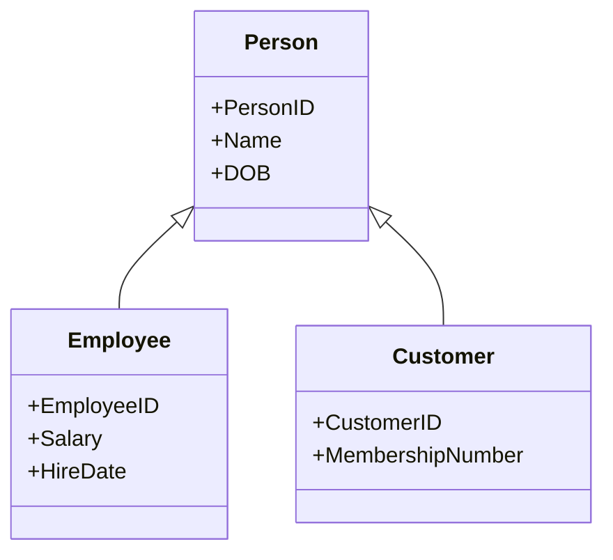

# EER Model

## Overview
The Enhanced Entity-Relationship (EER) model extends the basic ER model by adding more powerful modeling features. It is used when the data has inheritance, specialization, generalization, categories, or more complex relationships.

This model is especially useful in real-world systems where different kinds of entities share common characteristics.

---

## 1. Why EER is Needed

The standard ER model is very effective for basic entities and relationships. However, many real systems have:

- employees and customers both being persons,
- managers and regular employees sharing common attributes,
- different subtypes of products,
- overlapping entity categories,
- inheritance between entity types.

EER adds the concept of specialization/generalization to represent these patterns cleanly.

---

## 2. Superclass and Subclass

### Superclass
A general entity that contains common attributes.

Example:
- Person

### Subclass
A specialized entity that inherits from a superclass.

Examples:
- Employee
- Customer
- Student



---

## 3. Generalization and Specialization

### Generalization
Combining multiple similar entities into one higher-level entity.

Example:
- Car, Truck, Van -> Vehicle

### Specialization
Breaking one general entity into multiple more specific ones.

Example:
- Person -> Employee, Student, Customer

This is often described as an IS-A relationship.

---

## 4. Disjoint vs Overlapping

### Disjoint specialization
An instance belongs to only one subclass.

Example:
- A person is either an Employee or a Student, but not both.

### Overlapping specialization
An instance may belong to more than one subclass.

Example:
- A person may be both Employee and Customer.

---

## 5. Total vs Partial Specialization

### Total specialization
Every superclass instance must belong to at least one subclass.

Example:
- Every person is either a student or a staff member.

### Partial specialization
Some superclass instances may not belong to any subclass.

Example:
- Some people are not students and not employees.

---

## 6. Categories and Union Types

A category is a subclass formed from multiple unrelated entity types.

Example:
- A `VehicleOwner` may be either a Person or a Company.

This is useful when groups share the same role but do not belong to the same superclass.

---

## 7. Aggregation in EER

Aggregation models a relationship where one entity is composed of or structured around another relationship.

This is useful when we need to represent higher-level business objects like:

- project team membership,
- shipment containing multiple items,
- order includes product lines.

---

## 8. Example EER Diagram

```mermaid
erDiagram
    PERSON <|-- EMPLOYEE
    PERSON <|-- CUSTOMER
    PERSON <|-- STUDENT

    EMPLOYEE ||--o{ PROJECT : works_on
    STUDENT }o--o{ COURSE : enrolls
    CUSTOMER ||--o{ ORDER : places
```

This diagram shows specialization and relationship layering in a realistic system.

---

## 9. Diagram Illustration


This image is stored beside the lesson and helps visualize specialization, generalization, and inheritance patterns in the EER model.

---

## 10. SSMS and SQL Mapping

EER concepts are usually designed before implementation. In SSMS, the equivalent implementation often looks like:

1. Create a general table, like `Person`
2. Add subtype tables like `Employee`, `Customer`, `Student`
3. Add foreign keys from subtype tables back to the parent table
4. Define constraints to enforce specialization rules

---

## 11. Equivalent T-SQL Example

```sql
CREATE TABLE Person (
    PersonID INT PRIMARY KEY,
    Name VARCHAR(100) NOT NULL,
    DOB DATE
);

CREATE TABLE Employee (
    PersonID INT PRIMARY KEY,
    Salary DECIMAL(10,2),
    HireDate DATE,
    CONSTRAINT FK_Employee_Person
        FOREIGN KEY (PersonID)
        REFERENCES Person(PersonID)
);

CREATE TABLE Customer (
    PersonID INT PRIMARY KEY,
    MembershipNumber VARCHAR(50),
    CONSTRAINT FK_Customer_Person
        FOREIGN KEY (PersonID)
        REFERENCES Person(PersonID)
);
```

---

## 12. Exam-Friendly Summary

- EER model extends ER with inheritance and specialization
- Superclass = general type
- Subclass = specialized type
- Specialization and generalization model IS-A relationships
- Disjoint vs overlapping and total vs partial are important modeling choices
- EER helps represent realistic business hierarchies cleanly

> 💡 **Core idea**
> EER modeling lets us represent real-world inheritance and classification patterns that basic ER models cannot express well.

---

> 🔗 **See also**
> - [../01_ER_Model/theory.md](../01_ER_Model/theory.md)
> - [../04_EER_to_Relational_Mapping/theory.md](../04_EER_to_Relational_Mapping/theory.md)

