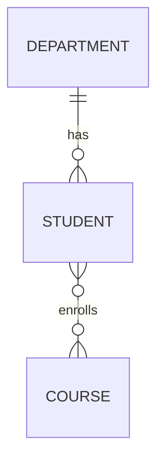

# ER to Relational Mapping

> Status: ✅ Built as the conceptual-to-relational translation lesson.

## Overview
ER-to-relational mapping is the process of transforming an ER diagram into a relational schema. This is the bridge between conceptual design and database implementation.

The goal is to convert entities, attributes, and relationships into tables, primary keys, foreign keys, and constraints that can be implemented in SQL.

---

## 1. Mapping Rules for Entities

### Strong entity
A strong entity becomes a table.

Example:
- `Student` becomes `Student` table
- attributes become columns
- primary key becomes the table key

```text
Student
- StudentID (PK)
- FirstName
- LastName
```

Translates to:

```sql
CREATE TABLE Student (
    StudentID INT PRIMARY KEY,
    FirstName VARCHAR(50),
    LastName VARCHAR(50)
);
```

### Weak entity
A weak entity also becomes a table, but its primary key includes the key of the parent entity.

Example:
- `Dependent` depends on `Employee`

```text
Dependent
- EmployeeID (FK + part of PK)
- DependentName (PK)
```

---

## 2. Mapping Attributes

### Single-valued attribute
Mapped to a column.

### Multivalued attribute
Mapped to a separate table.

Example:
- `PhoneNumber` for a student may become a separate `StudentPhone` table.

### Composite attribute
Mapped to multiple columns.

Example:
- `Name` -> `FirstName`, `LastName`

---

## 3. Mapping Relationships

### 1:1 relationship
Usually map by placing the key of one entity into the other or by creating a new table if needed.

### 1:N relationship
Place the key of the parent entity as a foreign key in the child table.

Example:
- `Department` (1) to `Student` (N)

```text
Student.DepartmentID FK -> Department.DepartmentID
```

### M:N relationship
Create a separate junction table with the keys of both entities.

Example:
- Student and Course

```text
Enrollment(StudentID, CourseID)
```

---

## 4. Example Mapping Diagram



Relational mapping:

```text
Department(DepartmentID PK, DepartmentName)
Student(StudentID PK, FirstName, LastName, DepartmentID FK)
Course(CourseID PK, CourseName)
Enrollment(StudentID FK, CourseID FK, PRIMARY KEY(StudentID, CourseID))
```

---

## 5. Mapping Rules Summary

| ER concept | Relational mapping |
|---|---|
| Entity | Table |
| Attribute | Column |
| Primary key | Primary key constraint |
| 1:N relationship | Foreign key in child table |
| M:N relationship | Junction table |
| Weak entity | Table with parent key in PK |
| Multivalued attribute | Separate table |

---

## 6. Diagram Illustration


This diagram shows how the conceptual ER design is translated into relational tables, keys, and foreign keys.

---

## 7. SSMS and SQL Mapping

In SSMS, after creating the conceptual design, the mapping typically becomes:

1. Create parent tables.
2. Create child tables and add foreign keys.
3. Create bridge tables for many-to-many relationships.
4. Set primary keys and constraints.
5. Validate referential integrity.

---

## 8. Equivalent T-SQL Example

```sql
CREATE TABLE Department (
    DepartmentID INT PRIMARY KEY,
    DepartmentName VARCHAR(100) NOT NULL
);

CREATE TABLE Student (
    StudentID INT PRIMARY KEY,
    FirstName VARCHAR(50) NOT NULL,
    LastName VARCHAR(50) NOT NULL,
    DepartmentID INT,
    CONSTRAINT FK_Student_Department
        FOREIGN KEY (DepartmentID)
        REFERENCES Department(DepartmentID)
);

CREATE TABLE Course (
    CourseID INT PRIMARY KEY,
    CourseName VARCHAR(100) NOT NULL
);

CREATE TABLE Enrollment (
    StudentID INT,
    CourseID INT,
    PRIMARY KEY (StudentID, CourseID),
    CONSTRAINT FK_Enrollment_Student
        FOREIGN KEY (StudentID)
        REFERENCES Student(StudentID),
    CONSTRAINT FK_Enrollment_Course
        FOREIGN KEY (CourseID)
        REFERENCES Course(CourseID)
);
```

---

## 9. Exam-Friendly Summary

- Each entity becomes a table.
- Each attribute becomes a column.
- One-to-many becomes a foreign key in the child table.
- Many-to-many becomes a junction table.
- Weak entities need parent keys as part of their primary key.

> 💡 **Core idea**
> ER-to-relational mapping transforms the conceptual model into a valid relational schema ready for SQL implementation.

---

> 🔗 **See also**
> - [../01_ER_Model/theory.md](../01_ER_Model/theory.md)
> - [../04_EER_to_Relational_Mapping/theory.md](../04_EER_to_Relational_Mapping/theory.md)
> - [../../04_Constraints_and_Integrity/PK_FK_Unique_Check_Default/theory.md](../../04_Constraints_and_Integrity/PK_FK_Unique_Check_Default/theory.md)
