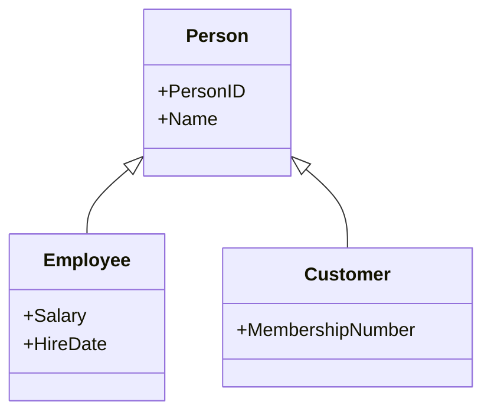

# EER to Relational Mapping

## Overview
EER-to-relational mapping extends the ER-to-relational process by handling inheritance, specialization, and generalization. The mapping rules must preserve the superclass-subclass relationships while still producing a valid relational design.

---

## 1. Main EER Mapping Approaches

### Single-table approach
Store all superclass and subclass attributes in one table.

Example:
```sql
Person(PersonID, Name, DOB, Salary, HireDate, MembershipNumber)
```

Advantages:
- simple queries
- easy to manage

Disadvantages:
- nulls for unused attributes
- less precise modeling

### Multiple-table approach
Create a superclass table and separate subclass tables.

Example:
```sql
Person(PersonID, Name, DOB)
Employee(PersonID, Salary, HireDate)
Customer(PersonID, MembershipNumber)
```

This is often the clearest and most normalized design.

---

## 2. Mapping Specialization

For specialization, we usually map as:

- one superclass table
- one subclass table per subtype
- subclass table contains only subtype-specific attributes
- subclass primary key is also a foreign key to the superclass primary key

Example:

```sql
CREATE TABLE Person (
    PersonID INT PRIMARY KEY,
    Name VARCHAR(100)
);

CREATE TABLE Employee (
    PersonID INT PRIMARY KEY,
    Salary DECIMAL(10,2),
    HireDate DATE,
    FOREIGN KEY (PersonID) REFERENCES Person(PersonID)
);
```

---

## 3. Mapping Generalization

Generalization is the reverse of specialization. We identify common attributes and create a shared superclass, then subclass tables with additional properties.

This produces a clean design when different entity types share common identity and behavior.

---

## 4. Mapping Disjoint vs Overlapping

### Disjoint specialization
A single row belongs to only one subclass.

Implementation usually uses separate subclass tables with `PersonID` as PK and FK to the superclass.

### Overlapping specialization
A row may belong to multiple subclasses.

Implementation often uses a separate bridge table or keeps multiple subtype tables with optional relationships.

---

## 5. Mapping Categories and Union Types

If a subclass is derived from multiple superclasses, it may need its own table and its own relationship keys.

Example:
- `VehicleOwner` may be either `Person` or `Company`

This requires careful mapping because the category spans multiple parent types.

---

## 6. Example EER Mapping Diagram



Relational output:

```text
Person(PersonID PK, Name)
Employee(PersonID PK/FK, Salary, HireDate)
Customer(PersonID PK/FK, MembershipNumber)
```

---

## 7. Diagram Illustration


This visual clarifies how superclass and subclass relationships become separate relational tables while preserving inheritance rules.

---

## 8. SSMS and SQL Mapping

In SSMS, the equivalent implementation is usually:

1. Create the top-level superclass table.
2. Create subtype tables.
3. Add foreign keys referencing the superclass.
4. Add constraints to enforce subtype rules when needed.
5. Validate relationships and data integrity.

---

## 9. Equivalent T-SQL Example

```sql
CREATE TABLE Person (
    PersonID INT PRIMARY KEY,
    Name VARCHAR(100) NOT NULL,
    DOB DATE
);

CREATE TABLE Employee (
    PersonID INT PRIMARY KEY,
    Salary DECIMAL(10,2),
    HireDate DATE,
    CONSTRAINT FK_Employee_Person
        FOREIGN KEY (PersonID)
        REFERENCES Person(PersonID)
);

CREATE TABLE Customer (
    PersonID INT PRIMARY KEY,
    MembershipNumber VARCHAR(50),
    CONSTRAINT FK_Customer_Person
        FOREIGN KEY (PersonID)
        REFERENCES Person(PersonID)
);
```

---

## 10. Exam-Friendly Summary

- EER mapping preserves superclass-subclass design
- Common attributes go to the superclass table
- Specialized attributes go to subclass tables
- Subclass tables usually reference the superclass by primary key
- This mapping keeps data organized and avoids unnecessary nulls

> 💡 **Core idea**
> EER-to-relational mapping converts inheritance-based designs into relational structures that remain consistent and well-structured.

---

> 🔗 **See also**
> - [../02_EER_Model/theory.md](../02_EER_Model/theory.md)
> - [../03_ER_to_Relational_Mapping/theory.md](../03_ER_to_Relational_Mapping/theory.md)
> - [../../04_Constraints_and_Integrity/PK_FK_Unique_Check_Default/theory.md](../../04_Constraints_and_Integrity/PK_FK_Unique_Check_Default/theory.md)
